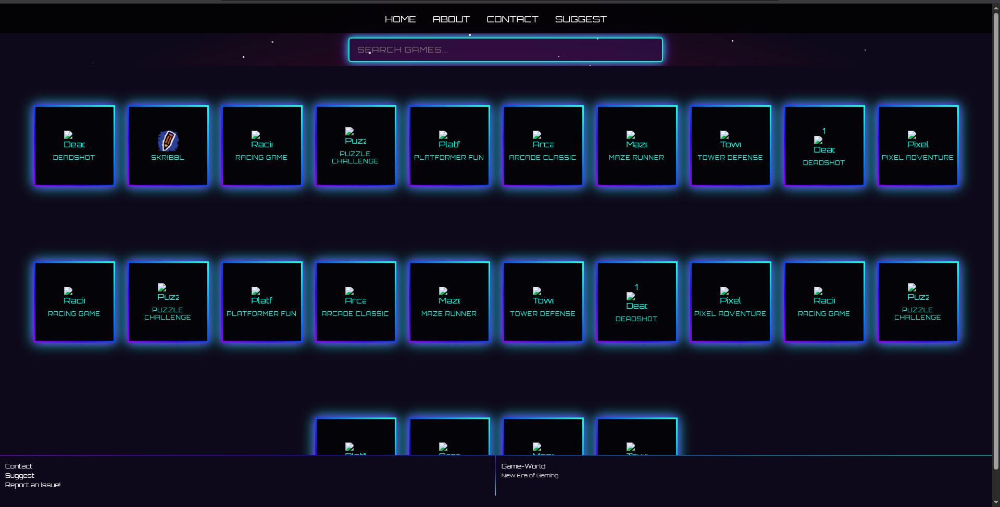
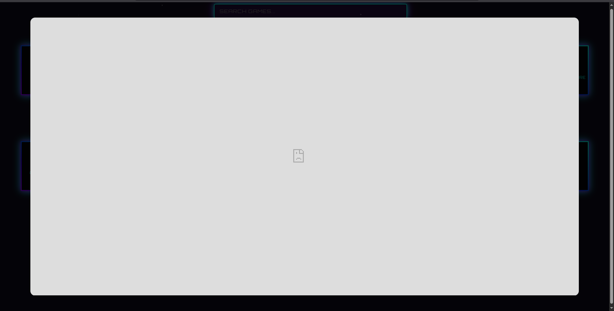

# Game-World 🎮🌌

**Game-World** is a dynamic, browser-based gaming platform built with React and styled using Tailwind CSS. It features a sleek dark theme with neon accents and offers an immersive experience through a collection of engaging online games, responsive design, and interactive modals.

---

## 🌐 Table of Contents

- [Features](#features)
- [Technologies](#technologies)
- [Installation](#installation)
- [Usage](#usage)
- [Screenshots](#screenshots)
- [Contributing](#contributing)
- [License](#license)

---

## ✨ Features

- **Responsive Navbar:**  
  Sticky and mobile-friendly, with a hamburger menu and links to Home, About, Contact, and Suggest.

- **Search Bar:**  
  Neon-styled, placed prominently for filtering games by title.

- **Game Cards:**  
  Interactive game cards displaying titles and thumbnails. Clicking opens the game in a modal using an `iframe`.

- **Modals:**
  - **About:** Displays project info with markdown-like formatting.
  - **Contact:** Form to submit inquiries via [Formsubmit](https://formsubmit.co).
  - **Suggest:** Form for suggesting new games.
  - **Bug Report:** Form to report issues with optional file upload.

- **Dynamic Footer:**  
  Contains quick links (Contact, Suggest, Bug Report), hides on scroll or when modals are open.

- **Starry Background:**  
  Animated stars and nebula glow for a cosmic feel.

- **Mobile-Friendly:**  
  Fully responsive for desktops, tablets, and smartphones.

---

## 🛠️ Technologies

- **Frontend:** React, JSX, CSS  
- **Forms:** [Formsubmit](https://formsubmit.co) for handling submissions  
- **Fonts:** [Orbitron](https://fonts.google.com/specimen/Orbitron) (Google Fonts)  
- **Deployment:** Compatible with Netlify, Vercel, or any static site host  
- **CDN:** React & dependencies via [jsDelivr](https://cdn.jsdelivr.net)

---



## 🚀 Installation

To run the project locally:

```bash
# Clone the repository
git clone https://github.com/rajnisht7/LevelUp.git
cd LevelUp

# Install dependencies
npm install

# Start the development server
npm start
